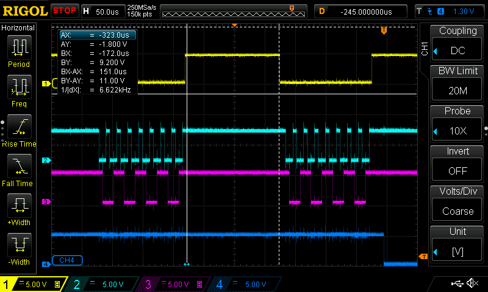
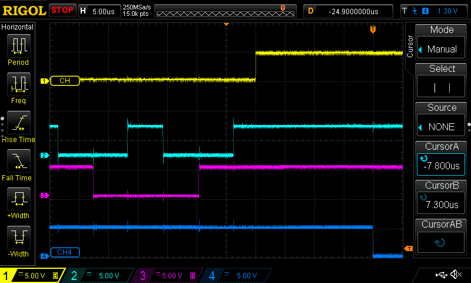

# Interface speed

It's really slow. Even with synchronous serial, we are getting about 58kbps - better than 38.4kbps, but not great. Also, the BUSY line stays on for 152us after *each byte*.

* CH1: BUSY
* CH2: SCLK
* CH3: SIN
* CH4: High while running `.display()`, low at the end.

As a result, a full screen blit takes 176ms.

## Serial bit-banging

Transferring one bit takes 17us, which is slow. `digitalWrite()` can take 7us! The code has 1us delays where the datasheet calls for 200ns setup and hold times around the SIN and SCLK edges, but these have no affect on an ATMEGA328-based Arduino.

