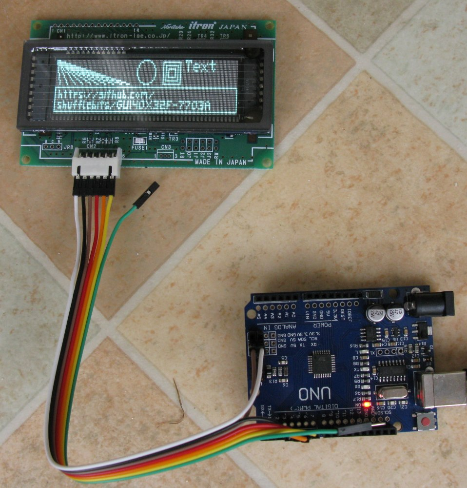
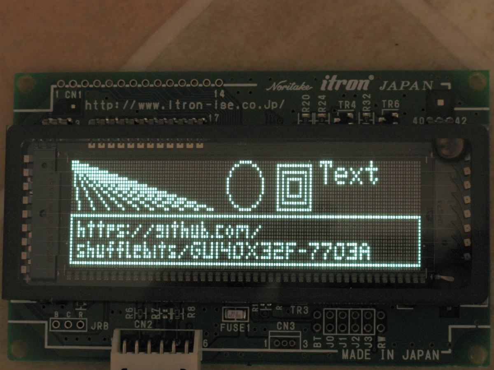

# GU140X32F-7703A_Adafruit_GFX
Implementation of the base class of the Adafruit_GFX library for the Noritake Itron GU140X32F-7703A VFD.

## It works!

## Connecting the display

|Signal name | Function | VFD Pin | Arduino Pin |
| :---: | :---: | :---: | :---: |
| V CC     | Power supply     |  1  | Any 5V    |
| SIN      | Data receive     |  2  | 3         |
| GND      | Ground           |  3  | Any GND   |
| SBUSY    | Display busy     |  4  | 4         |
| SCK      | Display clock    |  5  | 5         |
| /RESET   | Reset            |  6  | 6         |
| NC       | No connection    |  7  | nc        |

The Arduino pins used are defined in the constructor for the class. The pins here are as in the examples.

## Update modes.
The interface to the display, even in synhronous mode, is very slow. The library can be used in three ways, depending on the desired performance and coding complexity required.
There are examples for each one.

### Live mode

In this mode (selected by setting *vfd*`.livemode` to 1), the screen is updated as you draw. This is immensely slow, as a whole byte is transferred per pixel written. Since none of the drawing primitives of Adafruit_GFX have been optimised, things like font drawing and rectangle fills proceed one pixel at a time.

### Clear changed mode
By setting *vfd*`.livemode` to 0, drawing primitives only draw to the backing store, not the display. The display is only updated when *vfd*`.display()` is called. In order to reduce the amount of data transferred, only the pixel columns changed in the previous draw calls are copied to the display. If you draw a rectangle at 10,10, size 5x5, only pixel columns 10 to 15 get updated. This is the fastest mode for update, but it does require that you manage the blanking of regions overwritten by text that use the bitmap fonts.

## Clear and redraw mode
Set *vfd*`.livemode` to 0, then whenever the display should change, clear the backing store (with *vfd*`.clear()`), redraw all of the contents, then update the display with *vfd*`.display()`. You won't have to worry about blanking areas that need to change, and of course no flickernig happens as only the backing store is cleared. Updating the display is so slow that the computational overhead of regenerating the entire didplay contents is usually minimal. This is rather like writing display code for the U8G2 library.

## Details
More info [Here](Details.md)

## Acknowledgements
The small font in the static demo is copied from https://github.com/robjen/GFX_fonts, as the library is not yet in the Arduino Library manager. And 140 pixels isn't long enough for a Github URL!

